<!--
 Copyright 2024 David Araújo

 Licensed under the Apache License, Version 2.0 (the "License");
 you may not use this file except in compliance with the License.
 You may obtain a copy of the License at

     https://www.apache.org/licenses/LICENSE-2.0

 Unless required by applicable law or agreed to in writing, software
 distributed under the License is distributed on an "AS IS" BASIS,
 WITHOUT WARRANTIES OR CONDITIONS OF ANY KIND, either express or implied.
 See the License for the specific language governing permissions and
 limitations under the License.
-->

---
geometry: margin=25mm
title: Cloud Native Software Defined Network Project
date: August 1, 2024
---

| | |
| :- | :- |
| **Grant Reference** | BI Nº2023/00071 |
| **Grant Type** | Bolsa de Investigação |
| **Entity** | Instituto de Telecomunicações |
| **Entity's site** | Aveiro |
| **Grantee's Full Name** | David José Araújo Ferreira |
| **Supervisor** | Daniel Nunes Corujo |
| **Research Project** | CNSDN - Cloud Native Software Defined Networks |
| **Project Reference** | O-0003-AV-23 |
| **Period of the Grant** | Ausgust 2023 to July 2024 |

| | |
|:- | :- |
| | |
| Grantee's Signature | ____________________________ |
| | |
| Supervisor's Signature | ____________________________ |

# Executive summary

The objective is to deploy TeraFlow in a production-ready environment, emphasizing scalability, robustness, and resilience. A DevSecOps approach will be adopted to ensure continuous integration and delivery, while embedding security practices throughout the development lifecycle.

To achieve a secure, robust, and resilient Software-Defined Networking (SDN) controller, the deployment will maintain the key characteristics of the reference implementation design. This involves rigorous stress testing to validate the system's ability to handle high loads and adverse conditions.

A cluster deployment strategy will be implemented to enhance the system's scalability and fault tolerance. This will ensure that the TeraFlow SDN controller can manage network traffic efficiently, remain operational under various stress scenarios, and recover quickly from failures.

By focusing on these aspects, the deployment aims to deliver a reliable and high-performance SDN solution that meets the demands of modern, dynamic network environments.

\pagebreak

# Table of Contents

- [Executive summary](#executive-summary)
- [Table of Contents](#table-of-contents)
- [Network Configuration Protocol (NETCONF)](#network-configuration-protocol-netconf)
  - [What is Network Configuration Protocol (NETCONF)?](#what-is-network-configuration-protocol-netconf)
  - [How does NETCONF work?](#how-does-netconf-work)
  - [Base operations](#base-operations)
  - [Roles](#roles)
  - [Key Features](#key-features)
  - [Security](#security)
  - [Comparison with SNMP](#comparison-with-snmp)
    - [Data Representation](#data-representation)
    - [Security](#security-1)
    - [Operations](#operations)
    - [Interoperability](#interoperability)
- [Data Models](#data-models)
    - [What is data modeling?](#what-is-data-modeling)
    - [Why is data modeling done?](#why-is-data-modeling-done)
  - [OpenConfig](#openconfig)
    - [Data Models](#data-models-1)
    - [What is OpenConfig?](#what-is-openconfig)
    - [Goal](#goal)
    - [Principles](#principles)
  - [YANG](#yang)
    - [A model for network topology](#a-model-for-network-topology)
    - [Uses](#uses)
    - [Feature Highlights](#feature-highlights)
    - [Module](#module)
    - [Types](#types)
    - [Groupings](#groupings)
    - [Containers](#containers)
    - [Data Representations](#data-representations)
    - [Workflow](#workflow)
  - [gNMI](#gnmi)
    - [Why gNMI?](#why-gnmi)
    - [Updates](#updates)
    - [Terminology](#terminology)
    - [Streaming Telemetry](#streaming-telemetry)
    - [Using gNMIC](#using-gnmic)
    - [Authentication and Encription](#authentication-and-encription)
      - [Requirements on the network device (gNMI target)](#requirements-on-the-network-device-gnmi-target)
      - [Encryption](#encryption)
      - [Credentials and Authentication](#credentials-and-authentication)
      - [Telemetry Authentication](#telemetry-authentication)
- [Deployment](#deployment)
  - [Requirements](#requirements)
  - [Vagrant](#vagrant)
  - [Production](#production)
- [Reliability](#reliability)
  - [Single Mode](#single-mode)
    - [Dashboard Availability](#dashboard-availability)
    - [Synthetic load DOS attack](#synthetic-load-dos-attack)
    - [Large number of legitimate connections](#large-number-of-legitimate-connections)
    - [Prolonged attack effects](#prolonged-attack-effects)
    - [Multiple client scenarios](#multiple-client-scenarios)
    - [NGINX configuration](#nginx-configuration)
    - [Kubernetes Horizontal Pod Autoscaling](#kubernetes-horizontal-pod-autoscaling)
  - [Cluster Mode](#cluster-mode)
    - [Cockroach and NATS Cluster Mode Impact and Service Replicas](#cockroach-and-nats-cluster-mode-impact-and-service-replicas)
    - [Session management](#session-management)
    - [WebUI availability](#webui-availability)
    - [Node failure](#node-failure)
- [Clustering](#clustering)
  - [Creating the Microk8s Cluster](#creating-the-microk8s-cluster)
  - [Service Clustering](#service-clustering)
    - [CockroachDB](#cockroachdb)
    - [NATS](#nats)

\pagebreak

# Network Configuration Protocol (NETCONF)

## [What is Network Configuration Protocol (NETCONF)?](https://www.techtarget.com/searchnetworking/definition/NETCONF)

The Network Configuration Protocol (NETCONF) is an Internet Engineering Task Force (IETF) network management protocol that **provides a secure mechanism for installing, manipulating and deleting the configuration data on a network device**, such as a firewall, router or switch.

NETCONF was developed by the NETCONF working group and published in December 2006 as RFC 4741. The protocol was then revised in June 2011 and published as RFC 6241. This is the most current version. The IETF also published several other RFCs related to NETCONF. For example, RFC 5277 defines a mechanism for supporting an asynchronous message notification service for NETCONF.

The NETCONF protocol was designed to make up for the shortcomings of the Simple Network Management Protocol and the command-line interface scripting used to configure network devices.

## How does NETCONF work?

NETCONF **uses the Remote Procedure Call (RPC) protocol to carry out communications between clients and servers**. RPC is a client/server protocol that lets a program request a service from another program without understanding the details of the underlying network. RPC messages are encoded in Extensible Markup Language (XML) and transmitted via secure connection-oriented sessions.

A NETCONF **client**, which is often part of a network manager, _can be a script or application_. A **server is usually a network device**.

The client sends RFC messages that invoke operations on the server. **The client can also subscribe to receive notifications from the server**. The server executes the operations invoked by the client, and it can send notifications to the client.

A NETCONF s**erver contains one or more configuration datastores**. A configuration datastore is a datastore that holds all the configuration data needed to take a device from its default state to a configured operational state. A NETCONF datastore is simply a place to store and access configuration information. For example, the datastore might be a database, a set of files, a location in flash memory or any combination of these.

## Base operations

The NETCONF protocol supports a set of low-level operations for retrieving and managing device configuration information. The operations are specified through XML elements, which are described in the following table. NETCONF also supports additional operations based on each device's capabilities.

- <get> - Retrieves all or part of the information about the running configuration and device state.
- <get-config> - Retrieves all or part of the configuration information available from a specified configuration datastore.
- <edit-config> - Submits all or part of a configuration to a target configuration datastore.
- <copy-config> - Creates or replaces a target configuration datastore with the information from another configuration datastore.
- <delete-config> - Deletes a target configuration datastore, but only if it's not running.
- <lock> - Locks a target configuration datastore, unless a lock already exists on any part of that datastore.
- <unlock> - Releases a lock on a configuration datastore that was previously locked through a operation.
- <close-session> - Requests the NETCONF server to gracefully terminate an open session.
- <kill-session> - Forces a session's termination, causing current operations to be aborted.

\pagebreak

## Roles

- **Configuration**: NETCONF allows network administrators to remotely configure network devices, such as routers, switches, and firewalls, by specifying the desired configuration parameters.
- **Management**: It enables the retrieval of device configuration, status information, and operational data, which can be crucial for monitoring and managing network infrastructure.

## Key Features

- **XML-Based**: NETCONF uses XML (eXtensible Markup Language) for its data encoding format. This makes it human-readable and machine-parseable, enhancing interoperability and ease of use.
- **Protocol**: NETCONF typically runs over SSH (Secure Shell) or other secure transport protocols, ensuring the confidentiality and integrity of data during communication.
- **RPC (Remote Procedure Call)**: NETCONF employs RPC operations to perform various tasks, such as editing configurations, retrieving data, and executing commands on network devices.
- **YANG Data Modeling**: NETCONF often pairs with YANG (Yet Another Next Generation) data modeling language, which provides a standardized way to describe the data models for network configurations. YANG simplifies device modeling and helps ensure consistency in network management.

## Security

NETCONF inherently provides secure communication through SSH or TLS (Transport Layer Security), addressing many of the security concerns associated with SNMP, which initially lacked robust security features.

## Comparison with SNMP

### Data Representation

- SNMP uses a binary encoding format, making it less human-readable than NETCONF's XML format.
- NETCONF's XML format allows for more structured and complex data representation, which is helpful for expressing intricate configuration parameters.

### Security

- SNMP versions prior to SNMPv3 had limited security features, such as weak community string-based authentication. SNMPv3 improved security but is more complex to configure.
- NETCONF, from its inception, was designed with security in mind, supporting secure transport and authentication, making it more suitable for modern network security requirements.

### Operations

- SNMP primarily focuses on monitoring and collecting data (GET, GETNEXT, SET operations). While it can be used for configuration, it's not its primary purpose.
- NETCONF is designed for configuration and management tasks and provides a richer set of operations for these purposes.

### Interoperability

- SNMP has a wide range of implementations and has been widely used in networking for many years.
- NETCONF adoption has been increasing, but it may not be as prevalent in legacy networks as SNMP.

In summary, NETCONF is a protocol designed specifically for network configuration and management, with a focus on security and structured data representation. SNMP, on the other hand, is more traditionally used for monitoring and data collection, with configuration capabilities added later. The choice between the two protocols often depends on the specific network management needs and the devices in use. Modern networks may favor NETCONF for its robust security and configuration capabilities.

# Data Models

### [What is data modeling?](https://www.techtarget.com/searchdatamanagement/definition/data-modeling)

Data modeling is the process of creating a simplified diagram of a software system and the data elements it contains, using text and symbols to represent the data and how it flows. Data models provide a blueprint for designing a new database or reengineering a legacy application. Overall, data modeling helps an organization use its data effectively to meet business needs for information.

A data model can be thought of as a flowchart that illustrates data entities, their attributes and the relationships between entities. It enables data management and analytics teams to document data requirements for applications and identify errors in development plans before any code is written.

### Why is data modeling done?

Data modeling is a core data management discipline. By providing a visual representation of data sets and their business context, it helps pinpoint information needs for different business processes. It then specifies the characteristics of the data elements that will be included in applications and in the database or file system structures used to process, store and manage the data.

## OpenConfig

### Data Models

Data model development was the initial scope of the OpenConfig project, and continues to be one of our key deliverables. OpenConfig data models are written in YANG v1.0, the IETF standard data modeling language for network management with wide adoption in the networking industry.

OpenConfig data models have several advantages:

- **vendor-neutral** – OpenConfig models reflect a user perspective, and as such do not reflect any particular vendor’s implementation or convention.
- **operationally complete** – OpenConfig models are not intended to exhaustively cover every feature or protocol available; rather we focus on features most widely and commonly used by network operators.
- **consistent and cohesive** – OpenConfig data models all follow the same overall modeling approach, and share a common structure and style, making it easy to understand how different models work together.
- **configuration and telemetry** – OpenConfig models cover both configuration and monitoring data in the same model (in a standard, well-defined structure); we avoid the complications of multiple schemas, for example, to reflect different conceptual datastores.

### What is OpenConfig?

*"OpenConfig defines and implements a common, vendor-independent software layer for managing network devices. OpenConfig operates as an open-source project with contributions from network operators, equipment vendors, and the wider community. OpenConfig is led by an Operator Working Group consisting of network operators from multiple segments of the industry."*

Consistent and coherent data models designed by users for vendor-neutral management in a large variety of networking use cases.

Streaming telemetry is a subscription-based model for efficiently and accurately monitoring network devices based on OpenConfig models. Retire SNMP!

Device management and control protocols based on gRPC, a modern, secure RPC framework built for distributed services.

Vendor-independent automation to simplify and accelerate compliance testing of OpenConfig implementations.

### Goal

- Develop Vendor-Neutral Data Models for Configuration and Management that are supported natively by network hardware and software devices.
- Develop modern and efficient transport protocols for networking configuration, telemetry, and operations (gNMI & gNOI).

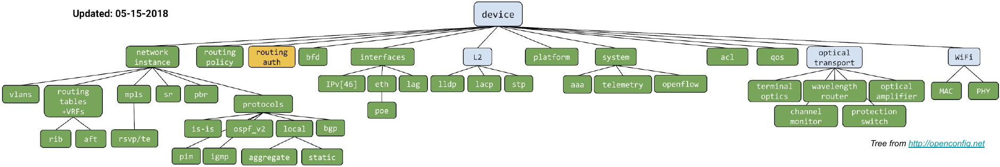

### Principles

Modular model definition.

The model structure combines.
- Configuration (intended).
- Operational data (applied config and derived state).

Each module subtree declares config and state containers.

Model backward compatibility.
- Driven by the use of semantic versioning (xx.yy.zz).
- Diverges from IETF YANG guidelines (full compatibility).

String patterns (regex) follow POSIX notation (instead of W3C as defined by IETF).


## YANG

YANG has become the data modeling language of choice for multiple network control and management aspects.

- Covering devices, networks, and services, even pre-existing protocols.
- YANG models configuration and state data.
- Significantly adopted, due in part, to its features and flexibility and the availability of tools.
- Examples:
  - An SDN controller may export the underlying optical topology in a format unambiguously determined by its associated YANG schema.
  - A high-level service may be described so that an SDN controller is responsible for mediating and associating high-level service operations to per-device configuration operations.

Models define the device configurations & notifications, capture semantic details, and are easy to understand.

Ongoing notable effort across the SDOs to model constructs (e.g. topologies, protocols).

A YANG model includes a **header, imports, and includes statements, type definitions, configurations, and operational data declarations as well as actions (RPC) and notifications.**

The language is expressive enough to:
- Structure data into data trees within the so called datastores, by means of encapsulation of containers and lists, and to define constrained data types (e.g. following a given textual pattern).
- Condition the presence of specific data to the support of optional features.
- Allow the refinement of models by extending and constraining existing models (by inheritance/augmentation), resulting in a hierarchy of models.
- Define configuration and/or state data.

It is used to express the structure of data, NOT the data itself.

Instances of data can be expressed in XML, JSON, Protobuf, etc., and are considered valid if they adhere to the YANG data model (schema).

From a YANG model, we care about 2 things:
1. Data tree organization (from which we get the paths and leaf data types).
2. The semantics of the leaf nodes (from the description field, usually in English).

### A model for network topology

A network consists of: Nodes and Links. A node consists of: node-id and ports. A port consists of: port-id and type of port. A link consists of: link-id, reference to the source node, reference to the target node, reference to the source port, and reference to the target port.


### Uses

YANG is a data modeling language designed to write data models for the NETCONF protocol. It provides the following features:
- Human readable, and easy-to-learn representation.
- Hierarchical configuration data models.
- Reusable types and groupings (structured types).
- Extensibility through augmentation mechanisms.
- Supports definition of operations (RPCs).
- Formal constraints for configuration validation.
- Data modularity through modules and sub-modules.
- Well-defined versioning rules.

### Feature Highlights
- YANG definitions directly map to NETCONF (XML) content.
- YANG uses a compact C and Java-like syntax with readability as the highest priority.
- Data type system leverages work done for next-generation SNMP type systems accommodating XML and XSD requirements.
- YANG can be formally translated to DSDL (RelaxNG, Schematron, and DSRL) as described in RFC 6110.
- There is also an informal translation to W3C XML Schema in the pyang tool.

\pagebreak

### Module

A module is a self-contained tree of nodes. Modules are the smallest unit that can be "compiled" by YANG tools.

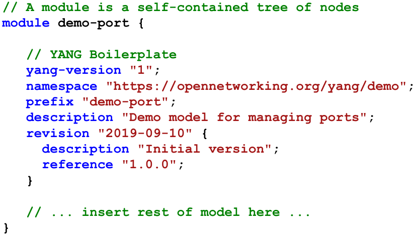

A module contains:

- boilerplate, like a namespace prefix for reference in other modules, description, version/ revision history, etc.
- identities and derived types-
- modular groupings.
- a top-level container that defines tree of data nodes.

\pagebreak

### Types

YANG defines several built-in types (including binary, bits, boolean, decimal64, empty, enumeration, identityref, int8, int16, int32, int64, string, uint8, uint16, uint32, uint64, decimal64).

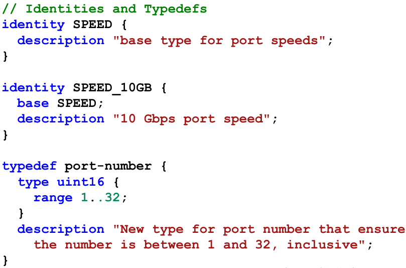

An identity is globally unique, abstract, and untyped. Identities are used to identify something with explicit semantics and can be hierarchical.

Derived types enable constraint of build-int types or other derived types, and they are defined using typedef.

\pagebreak

### Groupings

A grouping is a reusable set of nodes (containers and leaves) that can be included in a container. However, on its own a grouping does not add any nodes to the module in which it is defined or imported.

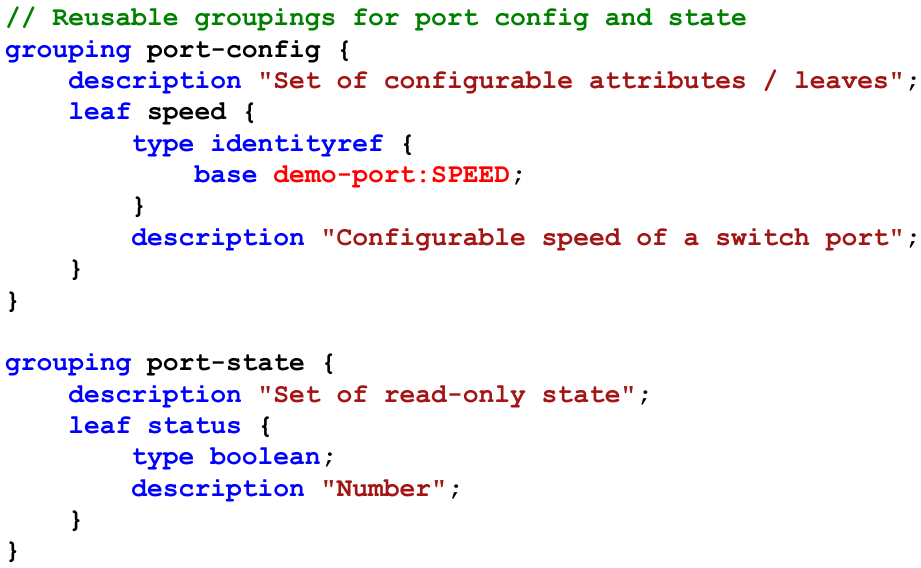

A leaf is a node that contains a value (built-in type or derived type) and has no children.

\pagebreak

### Containers

A container is a node with a set of children. Each module has one top-level or root container.

.png)

A list is a node that contains a set of multiple children of the same type. Lists elements are identified by a key.

Containers marked config false are state data that is read-only from a client's perspective. Typically, it is used for status or statistics.

### Data Representations

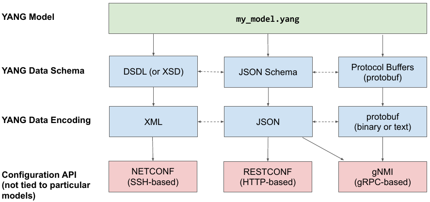

### Workflow

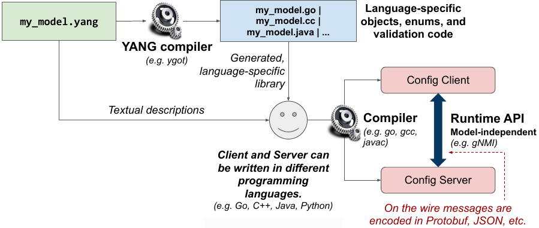

\pagebreak

## gNMI

[gNMI](https://github.com/openconfig/gnmi) is a protocol for the modification and retrieval of configuration from a target device, as well as the control and generation of telemetry streams from a target device to a data collection system.

This gNMI is described using [Protobuf](https://github.com/openconfig/gnmi/blob/master/proto/gnmi/gnmi.proto) and the data can be either encoded in JSON or in Protobuf (Currently in JSON).

It is a generic API to read and write configuration state. Suitable for any tree-based data model.
- YANG as a possible data model.

It is a possible successor of NETCONF.


### Why gNMI?

Provides a single service for state management:
- retrieving device capabilities (e.g. models supported).
- reading/writing configuration.
- receiving streaming telemetry updates.

```
service gNMI {
  rpc Capabilities(CapabilityRequest) returns (CapabilityResponse);
  rpc Get(GetRequest) returns (GetResponse);
  rpc Set(SetRequest) returns (SetResponse);
  rpc Subscribe(stream SubscribeRequest) returns (stream SubscribeResponse);
}
```

Built on a modern standard, secure transport and open RPC framework with many language bindings.

Supports very efficient serialization and data access.
- 3x-10x smaller than XML.

Offers an implemented alternative to NETCONF, RESTCONF, …
- early-release implementations on multiple router and transport platforms.
- reference tools published by OpenConfig.

\pagebreak

### Updates

Batches of configuration can be written or read using a list of Updates.

Updates consist of two parts:
- Relative path to data model.
- The value associated with the node.

Updates can transmit either:
- Configuration snapshots of a tree or sub-tree. (encoded in Protobuf or JSON)
- Leaf values only. (encoded as [path, value] entries)

Get, Set, and Subscribe use the same messages to send or receive updates.

### Terminology

- **Telemetry** - refers to streaming data relating to underlying characteristics of the device either operational state or configuration.
- **Configuration** - elements within the data schema which are read/write and can be manipulated by the client.
- **Target** - the device within the protocol that acts as the owner of the data that is being manipulated or reported on. Typically this will be a network device.
- **Client** - the device or system using the protocol described in this document to query/modify data on the target, or act as a collector for streamed data. Typically this will be a network management system.

### Streaming Telemetry

Operational state monitoring is crucial for network health and traffic management.

Examples:
- counters,
- power levels,
- protocol stats,
- up/down events,
- inventory,
- alarms,
- ...

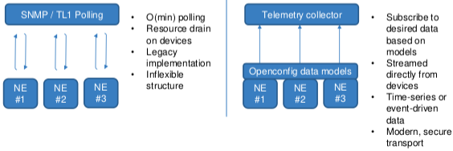

\pagebreak

### Using gNMIC

Installation
```bash
sudo bash -c "$(curl -sL https://get-gnmic.kmrd.dev)"
```

Capabilities request
```bash
gmnic -a clab-srlinux-srl1 -u admin -p NokiaSrl1! --skip-verify capabilities
```

GET request
```bash
gnmic -a clab-srlinux-srl1 -u admin -p NokiaSrl1! --skip-verify -e json_ietf \
get --path /interface[name=mgmt0]
gnmic -a clab-srlinux-srl1 -u admin -p NokiaSrl1! --skip-verify -e json_ietf \
get --path /system/name/host-name
```

SET request
```bash
gnmic -a clab-srlinux-srl1 -u admin -p NokiaSrl1! --skip-verify -e json_ietf \
set --update-path /system/name/host-name --update-value slr11
```

Subscribe request
```bash
gnmic -a clab-srlinux-srl1 -u admin -p NokiaSrl1! --skip-verify -e json_ietf \
subscribe --path /interface[name=mgmt0]/statistics
```


### Authentication and Encription

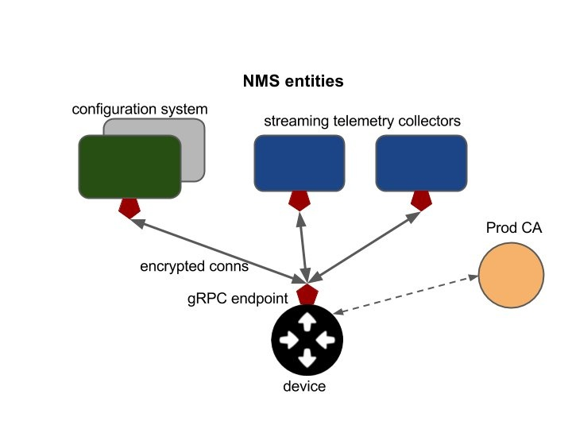

Network devices managed by the gRPC Network Management Interface (gNMI) must support secure bidirectional communication over a gRPC channel, along with standard authorization and accounting of all management operations.

#### Requirements on the network device (gNMI target)

- Allow installation of an X.509 PEM certificate and private key to enable server authentication for the TLS connection.
- Verify that certificates are valid on both sides and authenticate either with the gRPC-contained user and password, or the CN in the client certificate.
- Accept username/password credentials for authentication operations.
- Accept username to authorize operations against the device’s standard AAA (generally, TACACS) mechanisms.
- Use a single gRPC endpoint service for all operations (with separate RPCs supporting configuration and telemetry operations). Each client (e.g., telemetry collector or configuration system) may open a separate channel with its own authentication credentials.

\pagebreak

#### Encryption

- All communication between the gRPC client and server must be encrypted by TLS (TLS 1.2). The gRPC channel must be in an encrypted state before it is considered usable.
- If the client and server are unable to negotiate an encrypted channel, the channel establishment should fail with an error.
- Fallback to unencrypted communication is prohibited.
- The network element will perform certificate-based validation of the connecting network management system to ensure the endpoint is an authorized entity.
- The target must provide a means for the operator to install a certificate bundle on the network element, and the target must use the supplied bundle to validate incoming connections to the network element.
- The target must support a process to rotate the keyfile/certificate bundle periodically.

#### Credentials and Authentication
- Configuration operations carried over the encrypted connection will carry credentials (username/password) in the metadata of each gRPC message. Configuration changes require a user with Read-Write permission.
- The target will use these credentials to authorize the configuration operation using currently available AAA methods on the network element.
- The network element uses the local AAA configuration to determine where and what type of AAA request to issue.
  - For example, on a network element configured to use TACACS for command authorization, a Get(/interfaces) request for user:password would trigger a TACACS command authorization request using the same username.
- Future versions of the authentication scheme may use a username/password credential carried inside a field of the X.509 certificate, rather than exclusive use of RPC metadata.

#### Telemetry Authentication
- Each telemetry message will not be authenticated with a username/password; this is redundant and will not be a performant solution.
- Each telemetry message will only be carried over the encrypted gRPC streaming channel which was previously authenticated.
- Telemetry Subscribe() RPCs require a username/password credential inside the metadata. The Subscribe and Get RPCs do not make configuration changes to a device and thus should be allowed for users with Read-Only or Read-Write permissions.

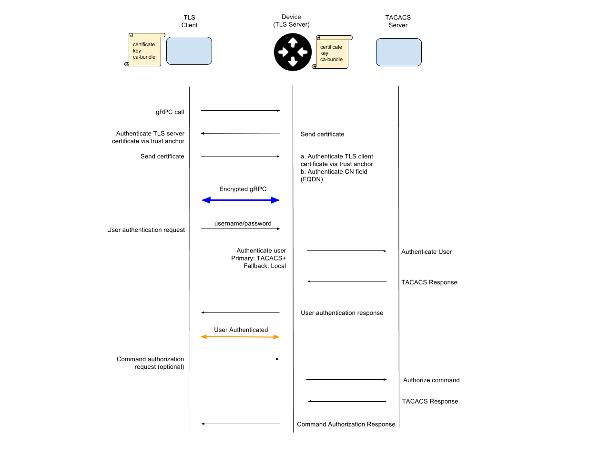

\pagebreak

# Deployment

## Requirements

TFS is composed of multiple microservices in a Kubernetes cluster. Because of this, for a robust and resilient deployment the minimum requirements are considerable, but even these may not be enough. From a DevSecOps point of view, where we expect a solution to be designed with the possibility of expanding its capacity to handle large amounts of traffic with high flexibility, the system requirements may be even more demanding.

Because of this, we envision a system with the following, minimum, requirements.
- A physical server or virtual machine for running the TFS controller with the following minimum specifications:
  - 4 cores / vCPUs
  - 12 GB of RAM
  - 100 GB of disk
  - 1 NIC card
- Working machine software:
  - Ubuntu Server 22.04.2 LTS or Ubuntu Server 20.04.6 LTS
  - MicroK8s v1.24.15

## Vagrant

During the initial phases of development, when TFS was set with minimal requirements, a single VM was necessary and so a Vagrant box was developed. This box contains and isolates all the dependencies to run TFS, forwards all the ports required to the host machine, and handles the reverse proxy necessary for this forwarding to occur with Linkerd.

## Production

In production environments, robust and reliable deployment is crucial. To achieve this, we require a more capable environment. We leveraged a more powerful virtualization server where we eventually established a cluster (refer to the Clustering section) for Microk8s services.

For our simulated production environment, we configured the following set of VMs, with each one serving as a Microk8s node within the cluster.

- Hub
  - CPU: 5 cores
  - Memory: 20 GiB
- Spoke1
  - CPU: 4 cores
  - Memory: 10 GiB
- Spoke2
  - CPU: 4 Cores
  - Memory: 10 GiB

These were the minimal system requirements necessary to ensure the stable operation of TFS. However, in this configuration, only CockroachDB and NATS were running in cluster mode, with three replicas spread across the three nodes. This implies that higher requirements could be expected when deploying all services with multiple replicas each.

\pagebreak

# Reliability

## Single Mode

### Dashboard Availability

During a potential Denial of Service (DOS) attack on the control plane of TFS, mainly the control dashboard, it is of the utmost importance that it is available to legitimate users. This means that the application should be able to filter out the legitimate connection, blocking all others whose only purpose is to saturate the bandwidth and/or the response capacity of the server.

Besides the capacity for filtering traffic, which can be time-consuming, more immediate solutions for dealing with traffic spikes must be implemented. Being that TeraFlowSDN is deployed as a Kubernetes cluster of different pods, pod/ service replication and traffic re-routing should be able to deal with, although momentarily, traffic spikes. At the same time, other more powerful and permanent actions are put in place (such as GeoIP blocking, rate limiting or load balancing).

### Synthetic load DOS attack

The first test consisted of simulating 255 clients, making 100000 requests between them, all to the same endpoint, /webui, which is where the dashboard is served. This test used the Apache Bench CLI tool, which was called with the following options:

```bash
ab -c 255 -n 100000 http://127.0.0.1:8080/webui
```


As shown above, the service is rapidly saturated with the large majority of the requests failing to retrieve any information, of the 100000 total requests, 97480 failed, which represents a 2.52% success rate. Adding to that, given such a small success rate, any legitimate attempt to access the dashboard will be proven unsuccessful.


From the Linkerd Viz dashboard, we can also see that the pod with the webuiservice is unable to respond to the requests and as a consequence, the response latency is also drastically increasing.


From observing the path of the traffic, we can observe that there appears to be a "bottleneck" regarding the webuiservice as the contextservice in turn can replicate pod when the traffic drastically increases, while the webuiservice is not.


\pagebreak

### Large number of legitimate connections

To simulate legitimate usage, such as users accessing the controller via a browser, Apache Bench was used with the following options:

- **k** - This enables the HTTP KeepAlive feature. KeepAlive allows the same TCP connection to be used for multiple HTTP requests, instead of opening a new connection for each request. This can significantly improve the efficiency of the test by reducing the overhead associated with establishing and tearing down connections for each request. In a real-world scenario, web browsers often use KeepAlive to fetch multiple resources (images, scripts, stylesheets) over the same connection to reduce latency.
- **H "Accept-Encoding: gzip, deflate"**  -This header informs the server that the client (in this case, Apache Bench) can accept content that is compressed using gzip or deflate encoding. This header is commonly used in real-world scenarios where the client supports compressed content. If the server also supports content compression, it can respond with compressed content, which can result in reduced data transfer and faster page loading times. 

```bash
ab -n 1000 -c 20 -k -H "Accept-Encoding: gzip, deflate" http://127.0.0.1:8080/webui
```

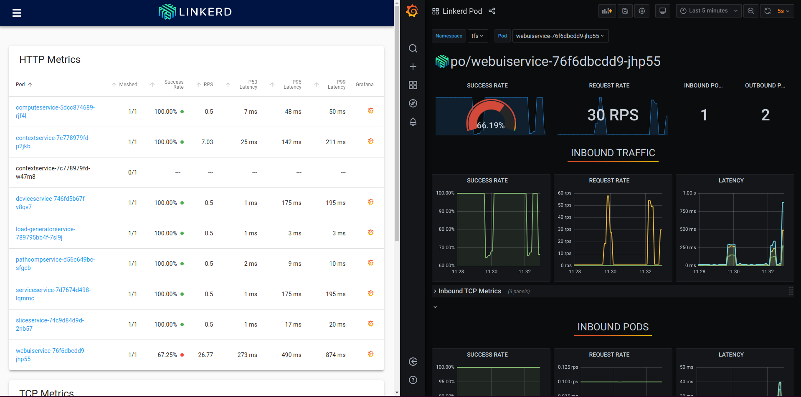


Although this yields greater success in terms of requests and responses, a **65.7% success rate** (using the Apache Bench values), we should also take into consideration that the number of requests is considerably smaller, and even so the latency suffers greatly with this volume of traffic. This volume is not considered by the application to be sufficiently high to trigger pod replication.

### Prolonged attack effects

In an attempt to simulate a more accurate DDOS attack, the Apache Benchmark tool was again used with similar options, but now performing successive tests with a total duration of several minutes. This was done by simply calling the test tool successively in an infinite loop using the following command.

```bash
while :; do ab -c 255 -n 1000000 http://127.0.0.1:8080/webui; done
```

.png)

Again, what we can see is that the service becomes overloaded with traffic and it is not capable of serving the proper content to a legitimate user (simulated by the curl request on the left). In fact, due to the duration of the attack, the webuiservice will eventually crash, making it unavailable during a time, even after the attack is stopped.


### Multiple client scenarios

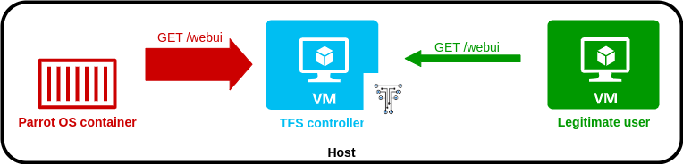

It is important to test if the measures to counter a possible DOS attack, besides being effective, protect the availability of the service to legitimate users. In this simulation, there are only two clients, one malicious (Parrot OS container) that will be flooding the server with very fast and concurrent requests, and one legitimate (regular VM) that will be performing requests at a low rate.

In the following screen capture, we can see that at the beginning of the attack, the legitimate user still maintains access to the server.


This however is short-lived, as the server quickly stops being able to respond to the volume of connections from the attacker, which affects the service of the client.


This triggers the contextservice pods to start replicating, however, these pods have no effect in alleviating the load of the webuiservice pods, resulting in the same outcome as previous tests, crashing the webui pod, totally negating any connection from any possible client.

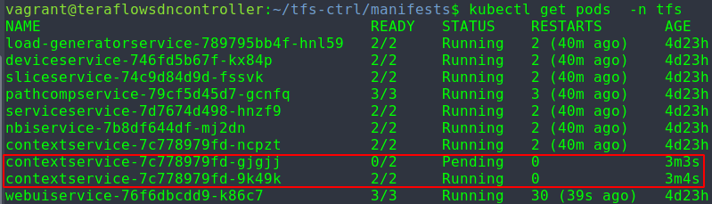


### NGINX configuration

This being a Kubernetes cluster web service, there is a pod responsible for proxying connections to the dashboard, this service is specified in the nginx_ingress_http.yaml. NGINX provides capabilities to limit the request rate and connection timeouts that could prove useful in this scenario, as such, the following rules were implemented:
- *limit-rps* - Requests per second - this limits the number of requests accepted from a given IP each second.
- *limit-connections* - Limit of concurrent connections - this limits the number of concurrent connections allowed from a single IP address.
- *proxy-connect-timeout* - specifies the maximum time allowed for a connection to be established between the Ingress controller and the backend service.
- *proxy-send-timeout* - specifies the maximum time the server should wait for sending data to the client.
- *proxy-read-timeout* - specifies the maximum time the NGINX proxy waits for a response from the backend server.


\pagebreak

Soon after, we can visualize that, although the attack is running, the attacker is unable to maintain a stable connection. However, the legitimate user is still able to request and retrieve content normally.


This prevents the triggering of pod replication and, as we can see from the Linkerd dashboard, maintains a high success rate for the service.


\pagebreak

### Kubernetes Horizontal Pod Autoscaling

Horizontal scaling means that the response to increased load is to deploy more Pods. This is different from vertical scaling, which for Kubernetes would mean assigning more resources (for example: memory or CPU) to the Pods that are already running for the workload.

With this feature, the goal is to maintain availability to the clients by spreading the load across multiple nodes in the case of an overload or request. This of course is not an optimal solution as the creation of replicas is not instantaneous and if this were to be the only measure against picks in traffic, the clients would have their requests denied for some time.

To test this, we applied HPA to the webuiservice, specifying that the pod should be replicated (up to 5 replicas), to maintain an average CPU utilization of 50%. The attack simulated 100 concurrent connections, each making 100 requests.

What was unexpected was that the load was not balanced between the new replicas and the original pod.

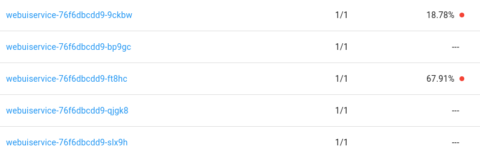

Because of this, even with the existence of replicas, the autoscaling quickly reaches the maximum of 5 replicas as the original pod maintains a high CPU usage. All of this, eventually causes the pods to crash.

After the attack is stopped, eventually the clients recover access to the service, but when that happens, they do so by receiving a new cookie, meaning that the session was not preserved and thus the context of the user is also not maintained.

\pagebreak

## Cluster Mode

### Cockroach and NATS Cluster Mode Impact and Service Replicas

Deploying CockroachDB and NATS in cluster mode enables the creation of three replicas for each of these services, and when in a MicroK8s cluster, to spread these replicas evenly across the node. This has benefits regarding the system's reliability when the nodes' stability may be compromised.

Besides node reliability, this deployment type should also provide increased stability when dealing with large amounts of traffic by load-balancing requests between the pods.

Enabling replicas in the services is also one important measure to improve resiliency, and it is necessary since by default TFS has it disabled. This can be done simply by uncommenting the line and changing the value to something like '3' in the desired manifests.

**However, if HPA is enabled, it is recommended that the value of spec.replicas of the Deployment and/or StatefulSet be removed from their manifest(s).**

Running the same tests as before, with the NGINX configurations we were already capable of blocking the repeated connections from a given source and thus the replication was not necessary in this use case. If there were to be a large set of sources such as in a DDOS, or even a large amount of legitimate connections, we can safely say that it would now be more capable or handling these connections, keeping in mind that this will be dependent of the configuration set, mainly regarding HPA and CRDB and NATS replicas.

### Session management

Having multiple pods responsible for maintaining the WebUI service, session management between them and the client demands that the service is stateless and as such the client can access it via any one of the pods. From what is visible in the source code of the WebUI component, we see that the services was envisioned to use cookies, although they do not appear to be fully implemented has of yet.

From what we can see, the cookie is just a digest from the hostname environment variable, not holding information of any special meaning for maintaining any sort of context.

Therefor, for our testing we commented the part of the code relating to the assignment of a cookie in order to avoid any conflict that could occur because of under developed code.

### WebUI availability

The first test was to simply see if the WebUI would stay available even if one of the nodes when down. At first we can see that it is possible to load and access the context from the both nodes (remember that pod are distributed evenly between nodes, as such, these pages are being served by different pods).


This allows us to load service, which is this particular case were responsible for configuring network device SRL1 and SRL2. The configurations for this services could be loaded and viewed from any node.

### Node failure

The advantage of clustering is to prevent, if a node becomes unavailable, the service becoming unavailable. To simulate this, we can simply stop the VM on proxmox, and after doing soo, we can observe the effects of the pods.

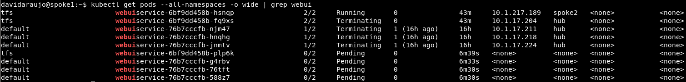

Is this case, we stopped the hub node, and as we can see, the spokes are able to resolve its pods failing and because of that, new replicas are being booted and will then be spread by the nodes.

MicroK8s takes some time to settle, but once it does, the user can access the WebUI and load services, and the pods responsible for that are now running on the spokes.

\pagebreak

# Clustering

TFS is deployed on top of a Microk8s instance, allowing for simple Kubernetes services management. Although MicroK8s is designed as an ultra-lightweight implementation of Kubernetes, it is still possible and useful to create a MicroK8s cluster to take advantage of its increased stability and resiliency.

Each node on a MicroK8s cluster requires its environment to work in, we accomplish this by running multiple VMs on the same network.

For now, we design a cluster consisting of three nodes.

## Creating the Microk8s Cluster

Most of the steps for this process can be found on Canonical's [*Create a Microk8s cluster*](https://microk8s.io/docs/clustering) wiki.

Some steps are not explicit in the wiki and they must be performed before proceeding:

1. Adding all the VMs' IPs and hostnames to each of the VM's /etc/hosts file.
2. Create a new Microk8s certificate for each VM.T
   1. This can by adding its IP to the csr.conf.template file and running the command (microk8s refresh-certs -e ca.cert) after adding the nodes as shown in the wiki.

## Service Clustering

### CockroachDB

Besides the obvious reasons for clustering with Kubernetes, TFS offers one particular configuration regarding the deployment of CockroachDB in cluster mode. This allows CockroachDB to maintain multiple pods in different locations.

For our use case, the ideal distribution would be a pod per node. To achieve this, first, we must ensure that the pod resource requirements are compatible with the node's available resources. By default, TFS is configured to request at least two cores, four gigabits of random access memory and sixty gigabits of storage memory. Although these are solid resources for a production environment, for testing these resource requirements were reduced.


Having three nodes allows the opportunity of forcing the pod replicas to be deployed in different locations. To accomplish this we can define topologySpreadConstraints specifying that pods must try to be distributed by all nodes with a maximum skew of one.

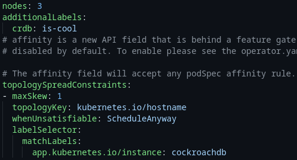

### NATS

All of these CockroachDB configurations should also work for NATS.

By default, TFS did not offer support for deploying NATS in cluster mode. By adding this capability to the system we can provide resiliency to the system in the same way we did with CockroachDB by creating multiple pods across the nodes in the cluster that can carry out each of the operations in case one of them fails.

Software applications and services need to exchange data. NATS is an infrastructure that allows such data exchange, segmented in the form of messages. NATS manages addressing and discovery based on subjects and not hostname and ports.

NATS has a built-in distributed persistence system called JetStream which enables new functionalities and higher qualities of service on top of the base 'Core NATS' functionalities and qualities of service. JetStream is built into nats-server and you only need 1 (or 3 or 5 if you want fault-tolerance against 1 or 2 simultaneous NATS server failures) of your NATS server(s) to be JetStream enabled for it to be available to all the client applications. JetStream provides both the ability to consume messages as they are published (i.e. 'queueing') as well as the ability to replay messages on demand (i.e. 'streaming').

NATS supports running each server in clustered mode. You can cluster servers together for high-volume messaging systems and resiliency and high availability. NATS servers achieve this by gossiping about and connecting to, all of the servers they know, thus dynamically forming a full mesh. Once clients connect or re-connect to a particular server, they are informed about current cluster members. Because of this behaviour, a cluster can grow, shrink and self-heal. The full mesh does not necessarily have to be explicitly configured either.

As for now, the cluster does not implement TLS in the communication between the replicas, however, this can be enabled if SSL certificates are provided.