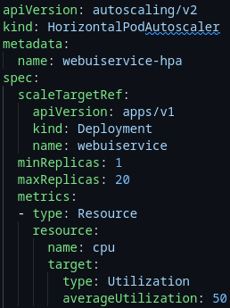

 

# TeraFlowSDN Controller for Resilient Systems

Cloud Native Software Defined Network Project **Workshop**
_April 29th, 2024_

David Araújo (IT)

---
<!-- paginate: true -->
<!-- header: TFS for Resilient Systems - Cloud Native Software Defined Network -->
<!-- footer:   Instituto de Telecomunicações e Altice Labs-->

# Objectives

This workshop serves to understand how to deploy TFS, as resiliently as possible, in a MicroK8s cluster.

We do this by:

- Understanding the TFS microservice structure.
- Understanding **Kubernetes resiliency mechanisms** that can be applied to services.
- Configuring **MicroK8s cluster**.
- Configuring **TFS' own resiliency mechanisms**.

---

# TFS Structure

TeraFlowSDN controller runs a number of microservices on top of a Kubernetes-based environment. TFS's services can be segregated into 4 section:

1. CockroachDB: database used by the _Context_ service for **long term storage**.
2. NATS: used by the _Context_ service has a **message broker to handle communications between services**.
3. QuestDB: used by the _Monitoring_ service, for storing **data resulting from monitoring the networks**.
4. TeraFlowSDN: the composition of **individual services** that combined constitute the controller.

---

# Kubernetes Resiliency Mechanisms

To achieve a robust and resilient deployment of TFS, we focused primarily on:

1. Node clustering
2. Pod distribution
3. Horizontal Pod autoscaling

We will review this concepts along the deployment of TFS.
---

## Node clustering

Using MicroK8s we gonna cluster **three nodes** for this workshop. If each node is a separate VM, each should match the minimum requirements:

- Ubuntu 20.04 or 22.04 LTS operating system (server or desktop)
- 4 vCPUs
- 12 GB of RAM
- 60 GB of storage

These requirement are quite considerable, but keep in mind they are **envisioned to be used in production** where there will be **multiple replicas of each pod**.

---

### Installing and Configuring Docker

Install the prerequisites.

```bash
sudo apt-get install -y ca-certificates curl gnupg lsb-release snapd jq docker.io docker-buildx
```

Add key "insecure-registries" with the private repository to the daemon configuration.

```bash
if [ -s /etc/docker/daemon.json ]; then sudo cat /etc/docker/daemon.json; else echo '{}'; fi \
    | jq 'if has("insecure-registries") then . else .+ {"insecure-registries": []} end' -- \
    | jq '."insecure-registries" |= (.+ ["localhost:32000"] | unique)' -- \
    | tee tmp.daemon.json
sudo mv tmp.daemon.json /etc/docker/daemon.json
sudo chown root:root /etc/docker/daemon.json
sudo chmod 600 /etc/docker/daemon.json
```

Restart the Docker daemon by with `sudo systemctl restart docker`

---

### Editing _/etc/hosts_

Add all the IPs of the machines you wish to make part of the cluster,  to the _/etc/hosts_ files of every one of those same machines, including the own.

In this example, this commands would be run in all three machines: _hub_, _spoke1_ and _spoke2_. 
```bash
echo '192.168.56.2 hub' | sudo tee -a /etc/hosts
echo '192.168.56.3 spoke1' | sudo tee -a /etc/hosts
echo '192.168.56.4 spoke2' | sudo tee -a /etc/hosts
```

---

### Installing MicroK8s

**Important**: Some TeraFlowSDN dependencies need to be executed on top of MicroK8s/Kubernetes v1.24. It is not guaranteed (by now) to run on newer versions.

```bash
sudo snap install microk8s --classic --channel=1.24/stable
sudo snap alias microk8s.kubectl kubectl
```

Add user to the `docker` and `microk8s` groups.

```bash
sudo usermod -aG docker $USER
sudo usermod -aG microk8s $USER
sudo mkdir -p /home/$USER/.kube
sudo microk8s config > /home/$USER/.kube/config
sudo chown -f -R $USER /home/$USER/.kube
```

---

### MicroK8s Clustering (1/2)

To set up a Microk8s cluster, start by **customizing the certificate template to include the interface's IP address in the shared network**. (Use the command below, replacing placeholder with the correct interface name)

```bash
INTERFACE="<interface-name>"
IP=$(ip -br -4 a | grep $INTERFACE | awk -F ' ' '{ print $3 }' | rev | cut -c 4- | rev)
sudo sed -i "s/#MOREIPS/IP.3 = $IP/g" /var/snap/microk8s/current/certs/csr.conf.template
```

Choose one of the machines as the master and run the following command.

```bash
microk8s add-node
```

This will print the command `microk8s join` which should be copied and run in the other nodes.

---

#### MicroK8s Clustering (2/2)

For the cluster to be up and running, on the nodes where the command `microk8s join` was run, run the following commands to regenerate the certificate and deploy the new configuration.

```bash
sudo microk8s refresh-certs -e ca.crt
sudo microk8s config > /home/$USER/.kube/config
```

After this, the cluster should be running correctly. You can check it by running

```bash
kubeclt get nodes
```

---

## Enabling Kubernetes addons (1/3)

First, we need to enable the community plugins (maintained by third parties).

```bash
microk8s.enable community
```

The addons to be enabled are:

- `dns`: enables resolving the pods and services by name
- `helm3`: required to install NATS
- `hostpath-storage`: enables providing storage for the pods (required by registry)
- `ingress`: deploys an ingress controller to expose the microservices outside Kubernetes
- `registry`: deploys a private registry for the TFS controller images

---

### Enabling Kubernetes addons (2/3)

- `linkerd`: deploys the linkerd service mesh used for load balancing among replicas
- `prometheus`: set of tools that enable TFS observability through per-component instrumentation
- `metrics-server`: deploys the Kubernetes metrics server for API access to service metrics

```bash
microk8s.enable dns helm3 hostpath-storage ingress registry prometheus metrics-server linkerd
```

---

### Enabling Kubernetes addons (3/3)

Then, create aliases to make the commands easier to access:

```bash
sudo snap alias microk8s.helm3 helm3
sudo snap alias microk8s.linkerd linkerd
```

Finally, validate that `linkerd` is working correctly.

```bash
linkerd check
```

And that `metrics-server` is also working correctly.

```bash
kubectl top pods --all-namespaces
```

---

# Deploying TFS

Has of the writing of this guide, some of the configurations related to HA and clustering of certain services are not yet part of the master branch of the TFS repository, and are only available at the [feat/86-testing-configurations-for-ddos-protection](https://labs.etsi.org/rep/tfs/controller/-/tree/feat/86-testing-configurations-for-ddos-protection?ref_type=heads) branch.

```bash
mkdir tfs-ctrl
git clone https://labs.etsi.org/rep/tfs/controller.git tfs-ctrl
cd tfs-ctrl
git switch feat/86-testing-configurations-for-ddos-protection
```

---

## TFS Cluster Modes

TFS already offers some options regarding clustering of services, namely in CockroachDB, and NATS added by us following the same pattern.

To enable them, simply set the environment variables in _my\_deploy.sh_ `CRDB_DEPLOY_MODE` and `NATS_DEPLOY_MODE` to _"cluster"_.

---

## Pod Distribution

<div class="columns">

<div>

Having multiple nodes in a cluster however does **not guarantee a balanced distribution of pods** between them, but we can force it.

```YAML
topologySpreadConstraints:
  - maxSkew: 1
    topologyKey: kubernetes.io/hostname  
    whenUnsatisfiable: ScheduleAnyway
    labelSelector:
      matchLabels:
        app.kubernetes.io/instance: cockroachdb
```

</div>

<div>

To achieve this, in **services with more than one replica by default** like CockroachDB and NATS, we specify `topologySpreadConstraints` and **explicitly define a skew of '1' in between hostnames** (which will be unique between nodes).

</div>
</div>

---

## Horizontal Pod autoscaling

<div class="columns">

<div>

In Kubernetes, a _HorizontalPodAutoscaler_ automatically updates a workload resource (such as a Deployment or StatefulSet), with the aim of automatically scaling the workload to match demand.

When enabled **we do not need to explicitly declare the number of replicas**, just the minimum and maximum that can be created.
</div>

<div>

For resiliency sake, we can set a **minimum of two replicas** per service.

<center>


</center>
</div>
</div>


---

## Launching TFS

Having done all of this, we can now launch the installation of TFS.

```bash
source my_deploy.sh
./deploy/all.sh
```